## TuddyFuddy

    

# 📱 TuddyFuddy - 먼저 연락하는 AI 친구
| 답장만 기다리는 AI NO! 진짜 <b>친구</b>처럼 먼저 연락하는 AI

<b>TuddyFuddy</b>는 당신의 일상을 함께하는 AI 친구예요. 날씨가 추워지면 겉옷을 챙기라고 알려주고, 중요한 발표 전에는 응원의 메시지를 보내죠. 그냥 심심할 때는 편하게 대화를 나눌 수 있는, 말 그대로 <b>'친구'</b> 같은 AI입니다.

**특별한 점**
- <b>선톡하는 AI</b>: 당신의 상황을 이해하고 먼저 대화를 시작해요
- <b>맞춤형 대화</b>: 날씨, 일정, 건강 데이터를 분석해 딱 맞는 대화를 해요
- <b>정서적 지원</b>: 외롭고 힘들 때 언제든 함께할 수 있어요

<b>TuddyFuddy</b>는 단순한 챗봇이 아닌, 당신의 일상을 더 따뜻하게 만들어주는 진정한 AI 친구입니다.

---

## 📋 목차

1. [**서비스 개요**](#서비스-개요)
2. [**프로젝트 기간**](#프로젝트-기간)
3. [**팀원 소개**](#팀원-소개)
4. [**주요 기능**](#주요-기능)
5. [**차별점**](#차별점)
6. [**기대 효과**](#기대-효과)
7. [**장기적 확장 방향**](#장기적-확장-방향)
8. [**소개 영상**](#소개-영상)
9. [**기술 스택**](#기술-스택)
10. [**프로젝트 구성도**](#프로젝트-구성도)
11. [**기능 시연**](#기능-시연)
12. [**포팅 메뉴얼**](#포팅-메뉴얼)
13. [**API 명세**](#api-명세)

---

## 서비스 개요

### 소개
<b>TuddyFuddy</b>는 갤럭시 워치, 날씨, 일정 등 다양한 데이터를 통합 분석하여 사용자의 감정과 생활 패턴을 이해하고, 먼저 주도적으로 대화를 시작하는 인공지능 서비스입니다. 정서적 지원을 제공하며, 정말 친한 친구처럼 공감하고 소통합니다. 사용자의 감정 변화, 일정, 건강 데이터를 학습하여 개인 맞춤형 대화를 제공하며, 외로움을 느끼는 사용자의 정서적 안정을 돕는 것을 목표로 합니다.

### 배경
최근 **고립 청년**과 **은둔 청년**이 사회적 이슈로 부각되면서, 이들이 느끼는 **정서적 고립과 외로움을 해결하기 위한 지원 서비스**의 필요성이 커지고 있습니다. 이들은 사회적 연결의 부족으로 심리적 어려움을 겪고 있으며, 이러한 문제는 고립 청년과 은둔 청년뿐만 아니라 **사회적 연결이 필요한 모든 사람들에게도 해당됩니다.** 현대 사회에서 개인 간의 소통이 단절되거나 약화되면서, **외로움과 정서적 지지가 필요한 사람들**이 점점 더 늘어나고 있습니다.

이에 따라, **사용자와 공감할 수 있는 AI 친구**를 통해 고립 청년과 은둔 청년, 그리고 사회적 연결이 필요한 사람들에게 **외로움을 덜 느끼고 정서적으로 안정**될 수 있도록 맞춤형 지원을 제공하고자 합니다. AI 친구는 **감정 분석**을 통해 사용자의 감정 변화를 파악하고, **위로와 격려**를 제공하며, 일상 속에서 **따뜻한 소통**을 나눠 정서적 안정을 도울 것입니다.

---
## 프로젝트 기간
**2024 SSAFY 11기 2학기 자율프로젝트**

**2024.10.14(월) ~ 2024.11.19(화) 5주**

---

## 팀원 소개

| 역할 | 이름 | 담당 업무 |
| --- | --- | --- |
| Backend | 이희주 | 팀장, 서버 개발(회원, 인증, 알림, config) |
| AI, Backend | 강유미 | 서버 개발(채팅), AI(대화 생성) |
| Backend | 김인엽 | 서버 개발(상황, 이미지), 인프라 |
| AI | 제갈덕 | AI(감정분석, 이미지 생성) |
| Frontend | 지경근 | UI/UX 개발(회원, 알림, 선톡) |
| Frontend | 최영빈 | UI/UX 개발(채팅) |

---
### **주요 기능**

1. **선톡 기능**
   - AI가 사용자의 데이터를 분석하여 주도적으로 대화를 시작합니다.
   - 날씨, 일정, 건강 상태를 바탕으로 맞춤형 메시지를 전달합니다.  
     - 예: "오늘 발표가 있다며? 긴장하지 말고 넌 잘 할거야!! 화이팅!!!👍"  
     - 예: "지금 비 온다는데? ☔ 우산 챙겼어??"

2. **건강 데이터 분석 및 대화**
   - 갤럭시 워치에서 심박수, 스트레스 지수 등 건강 데이터를 수집하여 분석합니다.
   - 건강 상태를 기반으로 조언이나 위로 메시지를 제공합니다.  
     - 예: "요즘 스트레스 많이 받지? 나랑 잠깐 산책 할래? 🚶"

3. **정서적 지원**
   - 사용자의 대화 내용을 기반으로 감정을 분석하고, 상황에 맞는 응답을 제공합니다.
   - AI는 공감형, 조언형 등 다양한 대화 스타일로 반응합니다.

4. **사용자 맞춤형 대화**
   - 일정, 날씨, 과거 대화 데이터를 학습하여 개인화된 대화 시나리오를 생성합니다.
   - 사용자 선호도에 따라 대화 스타일을 설정할 수 있습니다.  
     - 예: MBTI 기반 AI 친구 설정(T형/논리적 vs F형/감정적).

5. **AI 친구 선택**
   - 다양한 성격의 AI 친구 중 하나를 선택해 대화를 나눌 수 있습니다.  
     - 예: 밝고 명랑한 친구, 진중하고 현실적인 친구 등.

6. **이미지 분석 및 생성**
   - 사용자가 전송한 이미지를 분석하여 대화 주제로 활용하거나, 이미지 기반 대화를 제공합니다.
   - AI 이미지 생성 기능을 통해 유머, 재미 요소를 추가합니다.

---

### **차별점**

1. **선톡하는 AI**
   - 단순히 사용자의 메시지에 응답하는 AI가 아닌, 먼저 연락을 시도하는 AI로 차별화됩니다.  
   - 날씨, 건강 상태, 일정 데이터를 기반으로 AI가 주도적으로 대화를 시작합니다.

2. **다양한 데이터 기반 맞춤형 대화**
   - 사용자의 감정, 일정, 건강 데이터를 종합적으로 분석하여 개인화된 대화를 제공합니다.
   - 기존 챗봇과 달리 사용자의 상황에 맞는 대화 주제를 제안합니다.

3. **AI 친구의 개성화**
   - 사용자가 원하는 대화 스타일을 선택할 수 있으며, 다양한 AI 친구 캐릭터를 제공합니다.  
   - MBTI 기반 또는 유명 인물 스타일을 모델링한 AI 친구를 선택 가능.

4. **건강 데이터 연동**
   - 갤럭시 워치를 활용한 생체 데이터 연동 및 분석으로 감정과 건강을 모두 케어합니다.

5. **정서적 안정에 초점**
   - 대화의 목적이 단순 정보 제공이 아닌, 사용자의 정서적 안정과 고립감을 줄이는 데 있습니다.

6. **이미지 기반 소통**
   - 사용자가 전송한 이미지를 분석하여 대화 주제로 활용하거나, 이미지 기반 대화를 제공합니다.
   - AI 이미지 생성 기능을 통해 유머, 재미 요소를 추가합니다.

7. **단체 톡방**
    - 사용자는 실제 단톡방처럼 여러 AI 친구들과 단체 톡방에서 대화할 수 있습니다.
    - 한 대화에 대해 서로 다른 반응을 경험할 수 있습니다.

---

### **기대 효과**

1. **정서적 안정**
   - 사용자는 AI 친구와의 대화를 통해 심리적 안정감을 느끼고 외로움을 덜 느낄 수 있습니다.
   - 스트레스나 감정 기복이 큰 사용자에게 정서적 지지를 제공합니다.

2. **건강 관리**
   - 갤럭시 워치에서 수집된 생체 데이터를 기반으로 건강 상태를 모니터링하고 적절한 조언을 제공합니다.
   - 스트레스 감소와 생활 습관 개선에 기여합니다.

3. **데이터 학습으로 개인화 극대화**
   - 지속적인 데이터 학습을 통해 사용자의 감정 변화와 생활 패턴에 맞춘 맞춤형 대화를 제공합니다.
   - 시간이 지날수록 더 정교하고 만족스러운 대화 경험을 제공합니다.

4. **사회적 연결 강화**
   - 고립된 사용자에게 정서적 연결을 제공하여 사회적 소외감을 줄이고, 긍정적 상호작용을 강화합니다.

---

### **장기적 확장 방향**

1. **대화의 자연스러움 강화**
   - OpenAI와 같은 대규모 언어 모델(LLM)을 더욱 효과적으로 활용하여 대화의 자연스러움을 높입니다.
   - 사용자 데이터를 기반으로 감정에 더욱 민감하게 반응하는 고도화된 감정 분석 AI 도입.

2. **다양한 AI 친구 추가**
   - 사용자가 선택할 수 있는 AI 친구의 캐릭터와 성격을 확대합니다.  
     - 유명 인물 기반 캐릭터, 애니메이션 캐릭터 스타일 등 추가.

3. **맞춤형 모델 제공**
   - 프리미엄 기능으로, 사용자의 성향과 취미를 깊이 학습한 개인화된 AI 친구 제공.  
   - 개인화된 감정 및 대화 데이터를 활용하여 더욱 만족도 높은 서비스를 제공합니다.

4. **멀티 디바이스 확장**
   - 스마트폰 외에도 태블릿, 스마트 TV, 갤럭시 홈 허브 등 다양한 디바이스에서 AI 친구와 대화할 수 있도록 확장.

5. **글로벌 확장**
   - 다국어 지원을 통해 해외 사용자들에게도 서비스 제공.  
   - 문화와 언어에 따른 맞춤형 대화 시나리오 개발.

6. **헬스케어와의 연계 강화**
   - AI 친구가 건강 관리 코치 역할을 하며 운동 계획, 수면 관리, 영양 추천 등의 기능을 추가.  
   - 심박수, 수면 패턴 등 건강 데이터를 기반으로 웰빙을 관리하는 AI.

7. **음성 대화**
   - STT와 TTS를 사용해 실제와 같은 음성 대화를 경험할 수 있습니다.
   - 텍스트 뿐만 아니라 전화 통화하는 느낌을 받을 수 있습니다.

---

## 소개 영상

---

## 기술 스택

### Management Tool

### IDE

### Infra

### Frontend

### Backend

### **외부 API**

### 기술적 특장점

#### **1. AI 모델 통합 및 최적화**
- **KOTE**(Korean Online That-gul Emotions) 모델을 활용한 정확한 감정 분석으로 사용자의 감정 상태를 실시간으로 파악합니다.
- **Stable Diffusion**을 활용한 이미지 생성으로 AI 친구는 실제 사람처럼 사용자와 적절한 이미지를 주고받으며 자연스러운 대화를 진행합니다.
- **LangChain**을 활용한 프롬프트 체이닝으로 다양한 성격의 AI 페르소나를 구현했습니다.
- **GPT 모델**을 별도로 `fine-tuning`하여 특정 상황에 최적화된 응답을 제공합니다.

#### **2. MSA 기반 아키텍처**
- Spring Cloud와 Eureka를 활용한 **마이크로서비스 아키텍처** 구현으로 서비스 간 독립적인 확장과 운영이 가능합니다.
- Spring Cloud Gateway를 통한 효율적인 라우팅으로 각 서비스의 **안정적인 통신**을 보장합니다.
- Spring Cloud Config를 통해 유연한 설정 파일 적용이 가능합니다.

#### **3. 실시간 데이터 처리**
- **Apache Kafka**를 활용한 이벤트 기반 아키텍처로 실시간 데이터 처리와 서비스 간 비동기 통신을 구현했습니다.
- **Redis**를 활용한 고성능 캐싱으로 사용자 데이터와 날씨 데이터, 채팅 기록의 빠른 접근이 가능합니다.

#### **4. AI 기반 대화 생성**
- **OpenAI API**를 활용한 자연스러운 대화 생성으로 사용자 맞춤형 인터랙션을 제공합니다.
- **FastAPI**를 통한 효율적인 AI 모델 서빙으로 빠른 응답 시간을 보장합니다.

#### **5. 통합 데이터 관리**
- **PostgreSQL**을 활용한 안정적인 사용자 데이터 관리
- **Room Database**를 통한 효율적인 로컬 데이터 관리로 앱의 오프라인 기능을 지원합니다.

#### **6. 보안 및 인증**
- **Kakao OAuth**를 통한 안전한 사용자 인증 시스템 구축
- Spring Security를 활용한 엔드포인트 보안으로 서비스의 안정성을 확보했습니다.

#### **7. 모니터링 시스템**
- **Grafana**와 **Prometheus**를 활용한 실시간 시스템 모니터링
- Jenkins를 통한 자동화된 CI/CD 파이프라인으로 안정적인 배포 환경을 구축했습니다.

#### **8. 외부 서비스 연동**
- **Firebase Cloud Messaging**을 통한 효율적인 푸시 알림 시스템 구현
- 기상청 API를 활용한 실시간 날씨 정보 제공

---

## 프로젝트 구성도

### 시스템 아키텍처

1. **AWS EC2**:
   - TuddyFuddy 서비스는 AWS EC2 인스턴스에서 호스팅됩니다. 각 마이크로서비스들이 독립적으로 운영되며, 효율적인 리소스 관리가 가능합니다.

2. **Docker**:
   - 모든 서비스 컴포넌트는 Docker 컨테이너로 패키징되어 실행됩니다. 각 서비스는 독립적인 컨테이너에서 운영되어 배포와 확장이 용이합니다.

3. **Jenkins**:
   - Jenkins를 통한 CI/CD 파이프라인으로 자동화된 빌드 및 배포를 구현했습니다. GitLab과 연동하여 효율적인 개발 프로세스를 지원합니다.

4. **Spring Cloud Gateway 및 Eureka**:
   - Spring Cloud Gateway는 API 게이트웨이로서 각 서비스로의 라우팅을 담당합니다.
   - Eureka는 서비스 디스커버리를 통해 마이크로서비스 간의 동적 연결을 지원합니다.

5. **마이크로서비스**:
   - **Auth Service**: 카카오 OAuth 기반 인증을 담당하며, Redis를 활용한 세션 관리
   - **User Service**: 사용자 정보 관리 및 PostgreSQL 기반 데이터 저장
   - **Context Service**: 날씨, 일정 데이터 처리 및 Kafka를 통한 이벤트 처리
   - **Chat Service**: FastAPI 기반의 AI 대화 생성 및 Redis를 통한 대화 기록 관리
   - **Image Service**: AI 이미지 생성 및 분석 처리
   - **Notification Service**: FCM을 통한 푸시 알림 관리

6. **데이터베이스 및 캐싱**:
   - **PostgreSQL**: 사용자 데이터, 알림 내역 등의 영구 저장소
   - **Redis**: 세션 관리, 실시간 데이터 캐싱
   - **Room Database**: 안드로이드 앱의 로컬 데이터 저장

7. **메시징 시스템**:
   - **Kafka**: 서비스 간 비동기 통신 및 이벤트 처리
   - **Firebase Cloud Messaging**: 모바일 푸시 알림 전송

8. **AI 모델 통합**:
   - **OpenAI API**: GPT 모델 파인튜닝 및 자연스러운 대화 생성을 위한 기반 모델 제공
   - **Stable Diffusion**: AI 프로필 이미지 생성
   - **KOTE**: 한국어 감정 분석
   - **LangChain**: 프롬프트 체이닝을 활용하여 다양한 AI 페르소나 구현 및 일관된 대화 스타일 유지

9. **모니터링**:
   - **Grafana & Prometheus**: 실시간 시스템 모니터링
   - **Loki**: 로그 수집 및 분석

10. **외부 API 연동**:
    - **기상청 API**: 실시간 날씨 정보 수집
    - **카카오 개발자 API**: 사용자 인증 및 프로필 정보 연동
    - **AWS S3**: 이미지 파일 저장 및 관리

11. **클라이언트**:
    - **Android**: Jetpack Compose 기반의 모던 UI 구현
    - **Room Database**: 로컬 데이터 관리
    - **Samsung Health API**: 건강 데이터 연동

이 아키텍처를 통해 확장 가능하고 안정적인 서비스를 제공하며, AI 기술을 효과적으로 통합하여 사용자에게 개인화된 경험을 제공합니다.

---

### ERD

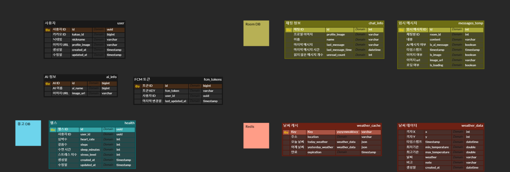

---

## 기능 시연
1. 가입 및 동의
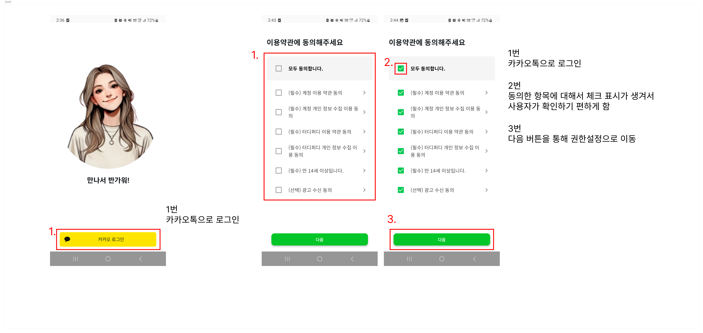

2. 권한 설정
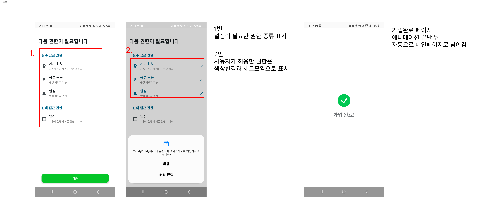

3. 메인페이지
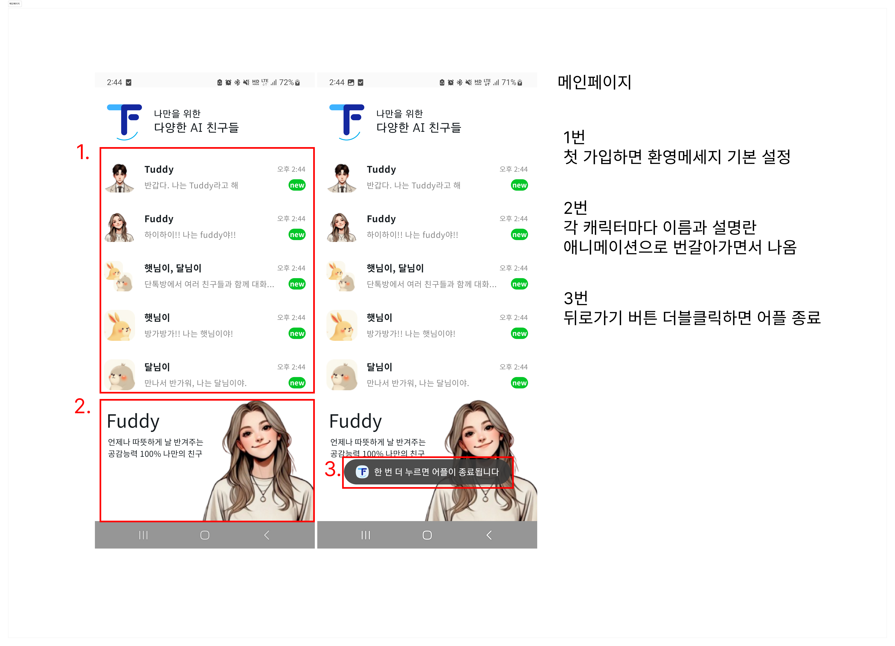

4. 채팅 알람 기능 및 백그라운드 작업
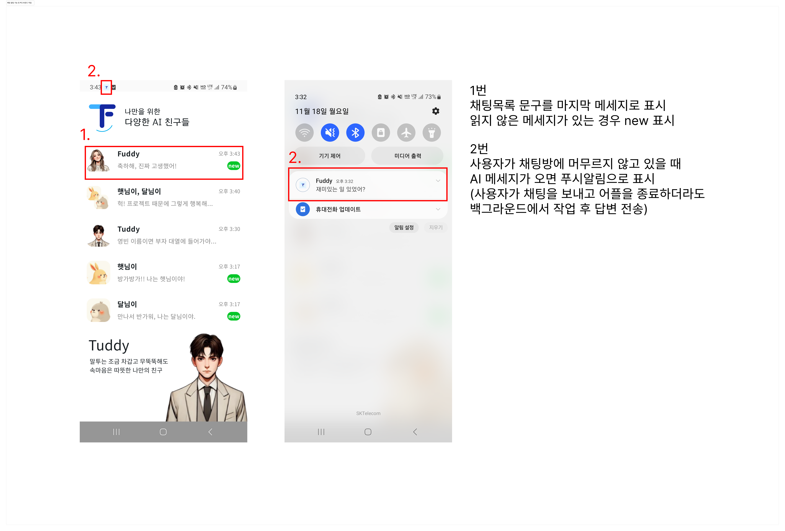

5. 개인 채팅방 화면
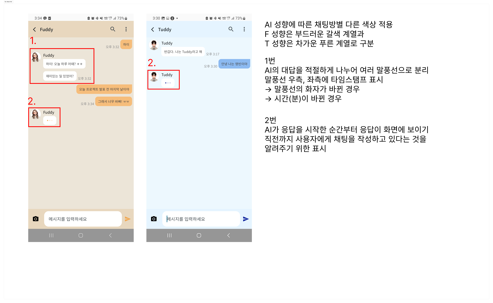

6. 사진 전송 및 생성 기능
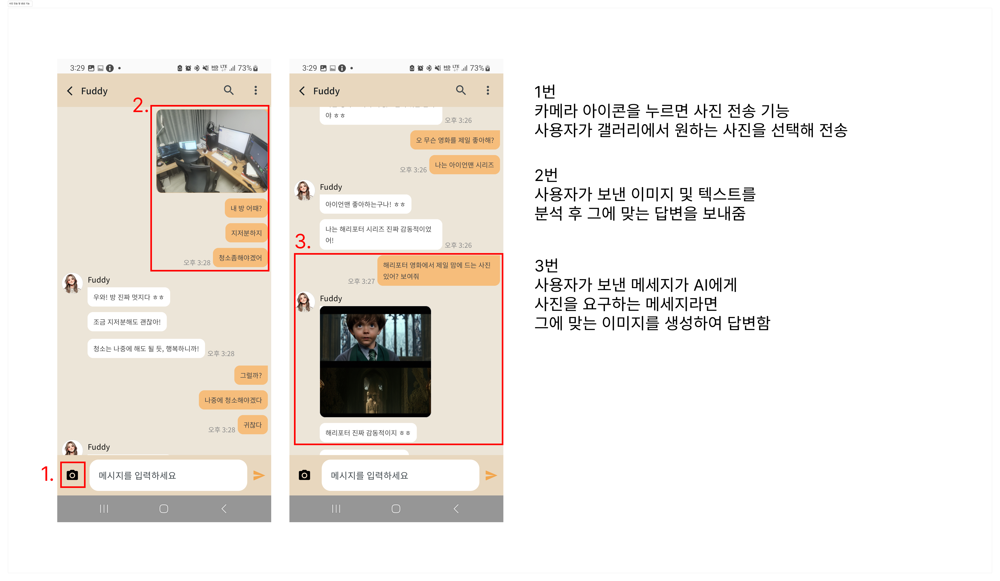

7. 키워드 검색 기능
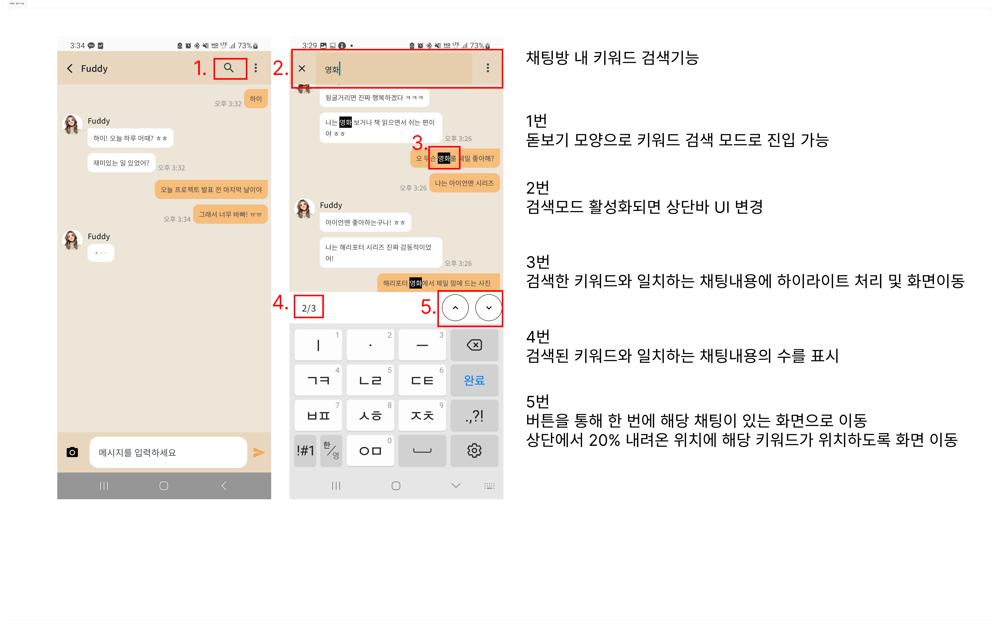

8. 채팅 내역 삭제 기능
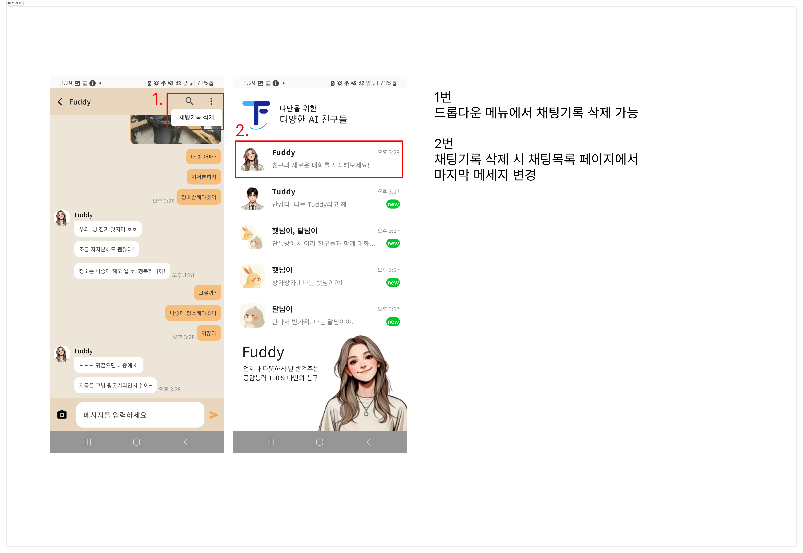

9. 단체 채팅방
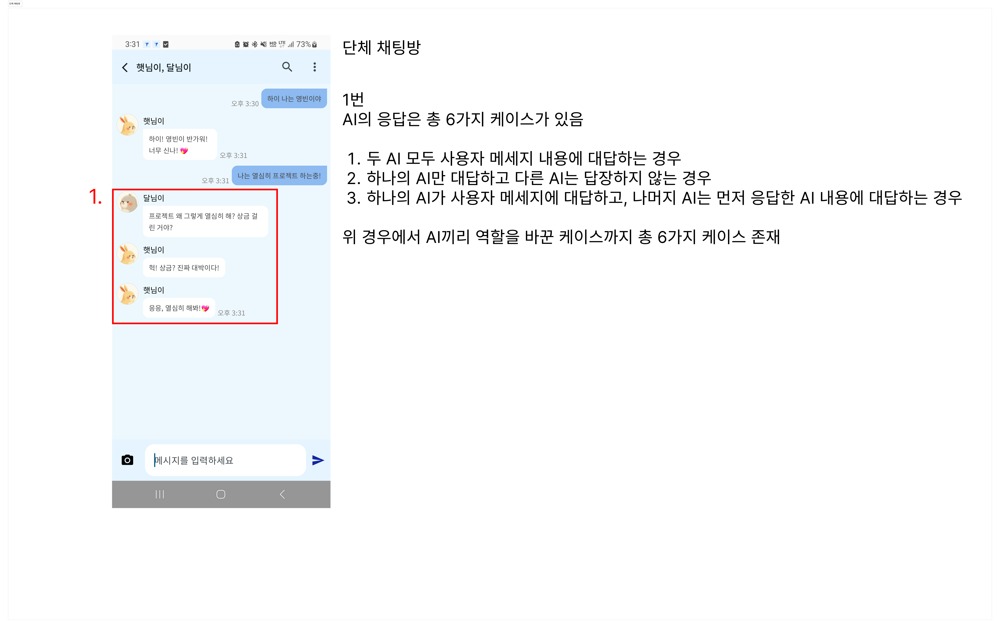

10. 날씨 및 캘린더 기반 선톡
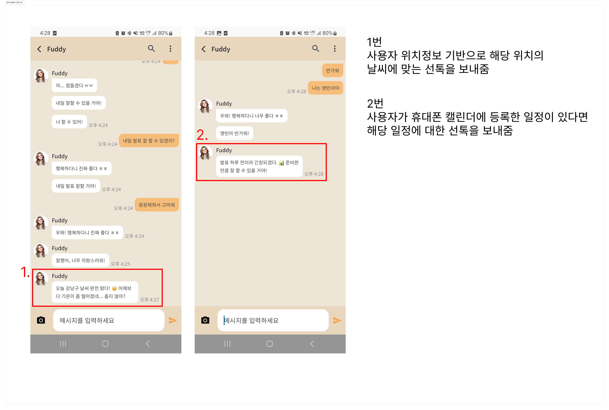

11. 삼성 헬스 데이터 기반 선톡
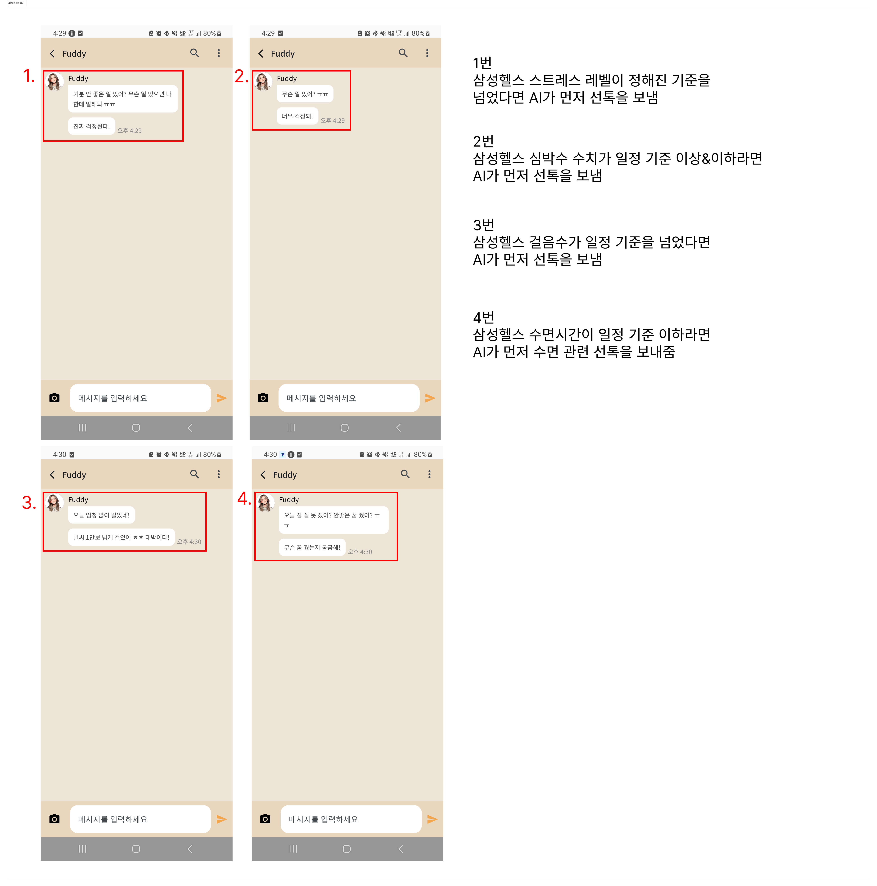

---

## 포팅 메뉴얼
[포팅 메뉴얼](./exec/11기_자율PJT_포팅메뉴얼_A510.pdf)

---

## API 명세

#### **사용자 API**
| **Method** | **Endpoint**         | **Description**                  | **Request Body/Parameters**                                                                                                                                                                | **Response**                                    |
|------------|----------------------|----------------------------------|--------------------------------------------------------------------------------------------------------------------------------------------------------------------------------------------|------------------------------------------------|
| POST       | `/users/kakao`       | 카카오 사용자 생성/수정           | JSON: `id`, `properties`, `kakao_account`                                                                                                                                                  | 200: User 정보 400: 오류                    |
| GET        | `/users`             | 회원 조회                        | 없음                                                                                                                                                                                       | 200: Member 정보 400: 오류                  |

---

#### **상황 데이터 API**
| **Method** | **Endpoint**                | **Description**                    | **Request Body/Parameters**                                                                                                                                                                | **Response**                                    |
|------------|-----------------------------|------------------------------------|--------------------------------------------------------------------------------------------------------------------------------------------------------------------------------------------|------------------------------------------------|
| POST       | `/context/weather`          | 날씨 정보 조회                     | Query: `latitude`, `longitude`                                                                                                                                                             | 200: 날씨 정보 400: 오류                    |
| POST       | `/context/health`           | 건강 데이터 생성                   | JSON: `heartRate`, `steps`, `sleepMinutes`, `stressLevel`                                                                                                                                  | 200: Health Response 400: 오류              |
| GET        | `/context/health/me`        | 사용자 건강 데이터 조회            | Query: `start`, `end` (선택적)                                                                                                                                                             | 200: Health List 400: 오류                  |
| POST       | `/context/calendar`         | 캘린더 조회                        | Query: `title`                                                                                                                                                                             | 200: 캘린더 정보 400: 오류                  |

---

#### **알림 API**
| **Method** | **Endpoint**                       | **Description**                | **Request Body/Parameters**                                                                                                                                                                | **Response**                                    |
|------------|------------------------------------|--------------------------------|--------------------------------------------------------------------------------------------------------------------------------------------------------------------------------------------|------------------------------------------------|
| POST       | `/notification/refresh-cache/{userId}` | 캐시 갱신                        | Path: `userId`                                                                                                                                                                             | 200: OK 500: 서버 오류                      |
| POST       | `/notification/chat`               | 채팅 알림 전송                  | JSON: `userId`, `roomId`, `aiName`, `message`, `messageType`                                                                                                                               | 200: OK 500: 서버 오류                      |
| GET        | `/notification/check-cache/{userId}` | 특정 캐시 상태 확인             | Path: `userId`                                                                                                                                                                             | 200: OK 500: 서버 오류                      |
| GET        | `/notification/check-all-cache`    | 전체 캐시 상태 확인             | 없음                                                                                                                                                                                       | 200: OK 500: 서버 오류                      |

---

#### **이미지 API**
| **Method** | **Endpoint**         | **Description**                  | **Request Body/Parameters**                                                                                                                                                                | **Response**                                    |
|------------|----------------------|----------------------------------|--------------------------------------------------------------------------------------------------------------------------------------------------------------------------------------------|------------------------------------------------|
| POST       | `/images/analysis`   | 이미지 분석                       | Form-data: `image (binary)`                                                                                                                                                                | 200: Analysis 결과 400: 오류                |
| POST       | `/images/ai/mix`     | 이미지 생성 (번역 포함)           | JSON: `text`                                                                                                                                                                               | 200: 이미지 URL 400: 오류                   |
| POST       | `/images/ai/gpt`     | GPT 이미지 생성                   | JSON: `text`                                                                                                                                                                               | 200: 이미지 URL 400: 오류                   |
| POST       | `/images/ai/duck`    | 이미지 생성 (추가 API 사용)        | JSON: `text`                                                                                                                                                                               | 200: 이미지 URL 400: 오류                   |

---

#### **인증 API**
| **Method** | **Endpoint**         | **Description**                  | **Request Body/Parameters**                                                                                                                                                                | **Response**                                    |
|------------|----------------------|----------------------------------|--------------------------------------------------------------------------------------------------------------------------------------------------------------------------------------------|------------------------------------------------|
| POST       | `/auth/reissue`      | 리프레시 토큰 갱신                | Cookie: `refresh_token`                                                                                                                                                                    | 200: OK 401/400/503/500: 오류               |
| POST       | `/auth/kakao`        | 카카오 로그인                     | JSON: `accessToken`, `fcmToken`                                                                                                                                                            | 200: OK 401/400/503/500: 오류               |

---

#### **채팅 API**
| **Method** | **Endpoint**               | **Description**                  | **Request Body/Parameters**                                                                                                                                                                | **Response**                                    |
|------------|----------------------------|----------------------------------|--------------------------------------------------------------------------------------------------------------------------------------------------------------------------------------------|------------------------------------------------|
| POST       | `/chats/direct/{room_id}`  | 개인 채팅                        | Path: `room_id` JSON: `text`                                                                                                                                                            | 200: OK 422: Validation 오류                |
| POST       | `/chats/group/{type}`      | 그룹 채팅                        | Query: `room_id` JSON: `text`                                                                                                                                                           | 200: OK 422: Validation 오류                |
| GET        | `/chats/history/{room_id}` | 채팅 기록 조회                   | Path: `room_id`                                                                                                                                                                            | 200: 채팅 기록 422: Validation 오류         |

---
